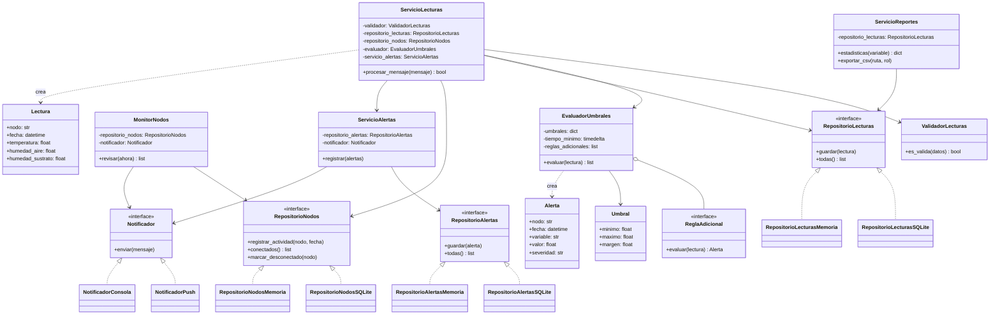
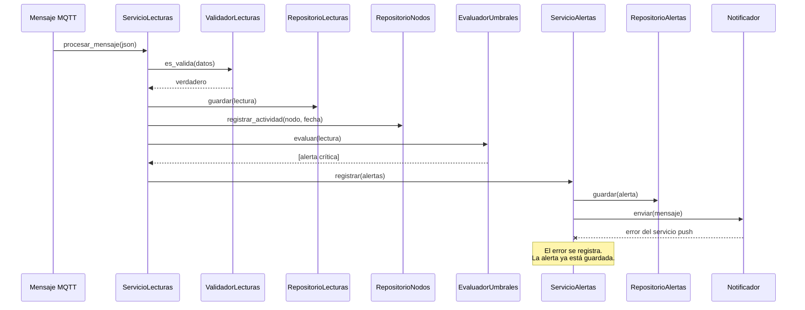

# Diagramas de la versión de capas

## Diagrama de clases

```mermaid
classDiagram
    direction TB

    class ServicioLecturas {
        -validador: ValidadorLecturas
        -repositorio_lecturas: RepositorioLecturas
        -repositorio_nodos: RepositorioNodos
        -evaluador: EvaluadorUmbrales
        -servicio_alertas: ServicioAlertas
        +procesar_mensaje(mensaje) bool
    }
    class ServicioAlertas {
        -repositorio_alertas: RepositorioAlertas
        -notificador: Notificador
        +registrar(alertas)
    }
    class ServicioReportes {
        -repositorio_lecturas: RepositorioLecturas
        +estadisticas(variable) dict
        +exportar_csv(ruta, rol)
    }
    class MonitorNodos {
        -repositorio_nodos: RepositorioNodos
        -notificador: Notificador
        +revisar(ahora) list
    }
    class ValidadorLecturas {
        +es_valida(datos) bool
    }
    class EvaluadorUmbrales {
        -umbrales: dict
        -tiempo_minimo: timedelta
        -reglas_adicionales: list
        +evaluar(lectura) list
    }
    class ReglaAdicional {
        <<interface>>
        +evaluar(lectura) Alerta
    }
    class RepositorioLecturas {
        <<interface>>
        +guardar(lectura)
        +todas() list
    }
    class RepositorioAlertas {
        <<interface>>
        +guardar(alerta)
        +todas() list
    }
    class RepositorioNodos {
        <<interface>>
        +registrar_actividad(nodo, fecha)
        +conectados() list
        +marcar_desconectado(nodo)
    }
    class Notificador {
        <<interface>>
        +enviar(mensaje)
    }
    class RepositorioLecturasSQLite
    class RepositorioLecturasMemoria
    class RepositorioAlertasSQLite
    class RepositorioAlertasMemoria
    class RepositorioNodosSQLite
    class RepositorioNodosMemoria
    class NotificadorPush
    class NotificadorConsola
    class Lectura {
        +nodo: str
        +fecha: datetime
        +temperatura: float
        +humedad_aire: float
        +humedad_sustrato: float
    }
    class Alerta {
        +nodo: str
        +fecha: datetime
        +variable: str
        +valor: float
        +severidad: str
    }
    class Umbral {
        +minimo: float
        +maximo: float
        +margen: float
    }

    ServicioLecturas --> ValidadorLecturas
    ServicioLecturas --> EvaluadorUmbrales
    ServicioLecturas --> RepositorioLecturas
    ServicioLecturas --> RepositorioNodos
    ServicioLecturas --> ServicioAlertas
    ServicioAlertas --> RepositorioAlertas
    ServicioAlertas --> Notificador
    ServicioReportes --> RepositorioLecturas
    MonitorNodos --> RepositorioNodos
    MonitorNodos --> Notificador
    EvaluadorUmbrales o-- ReglaAdicional
    EvaluadorUmbrales --> Umbral
    EvaluadorUmbrales ..> Alerta : crea
    ServicioLecturas ..> Lectura : crea

    RepositorioLecturas <|.. RepositorioLecturasSQLite
    RepositorioLecturas <|.. RepositorioLecturasMemoria
    RepositorioAlertas <|.. RepositorioAlertasSQLite
    RepositorioAlertas <|.. RepositorioAlertasMemoria
    RepositorioNodos <|.. RepositorioNodosSQLite
    RepositorioNodos <|.. RepositorioNodosMemoria
    Notificador <|.. NotificadorPush
    Notificador <|.. NotificadorConsola
```

## Diagrama de secuencia: llega una lectura fuera de rango

```mermaid
sequenceDiagram
    participant MQTT as Mensaje MQTT
    participant SL as ServicioLecturas
    participant V as ValidadorLecturas
    participant RL as RepositorioLecturas
    participant RN as RepositorioNodos
    participant E as EvaluadorUmbrales
    participant SA as ServicioAlertas
    participant RA as RepositorioAlertas
    participant N as Notificador

    MQTT->>SL: procesar_mensaje(json)
    SL->>V: es_valida(datos)
    V-->>SL: verdadero
    SL->>RL: guardar(lectura)
    SL->>RN: registrar_actividad(nodo, fecha)
    SL->>E: evaluar(lectura)
    E-->>SL: [alerta crítica]
    SL->>SA: registrar(alertas)
    SA->>RA: guardar(alerta)
    SA->>N: enviar(mensaje)
    N--xSA: error del servicio push
    Note over SA: El error se registra.<br/>La alerta ya está guardada.
```
